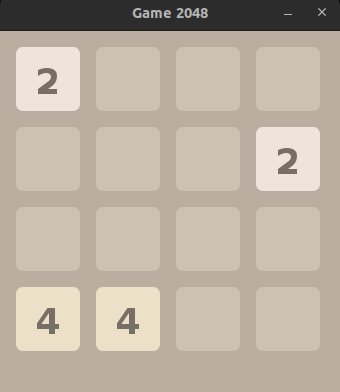
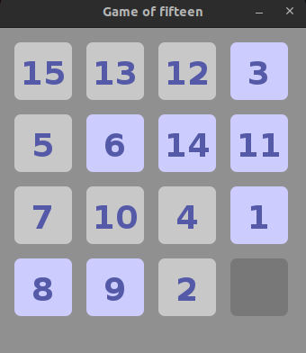

# Kotlin Game Projects – 2048 & Game of Fifteen

This repository contains two classic puzzle games – **2048** and **Game of Fifteen** – implemented in Kotlin as part of the **"Kotlin for Java Developers"** course on **Coursera**, offered by JetBrains. These projects were completed as official course assignments and serve as a practical demonstration of applying Kotlin concepts to game logic.

## 🎓 Course Information

- **Course**: [Kotlin for Java Developers](https://www.coursera.org/learn/kotlin-for-java-developers)
- **Platform**: Coursera
- **Institution**: JetBrains
- **Certificate**: Awarded upon successful completion of all modules and assignments

## 🎮 Games Included

### 1. 2048
2048 is a single-player sliding tile puzzle game. The objective is to combine numbered tiles on a 4x4 grid to create a tile with the number 2048.

**Features:**
- 4x4 grid logic
- Merge and slide mechanics
- Random tile spawning (2 or 4)
- Game-over detection

### 2. Game of Fifteen
The Game of Fifteen (also known as the 15-puzzle) is a sliding puzzle consisting of a 4x4 grid with numbered tiles from 1 to 15 and one empty space. The player must rearrange the tiles into numerical order by sliding them into the empty space.

**Features:**
- Valid move detection
- Win condition check
- Random shuffle on start

 **Screenshot:**

## 🛠️ Tech Stack

- **Language**: Kotlin
- **Tools**: Android Studio
- **Build System**: Gradle (optional)

## 🧠 Concepts Demonstrated

- Kotlin basics and syntax
- Extension functions and properties
- Collections and algorithms
- Immutable data manipulation
- Game logic and 2D grid management
